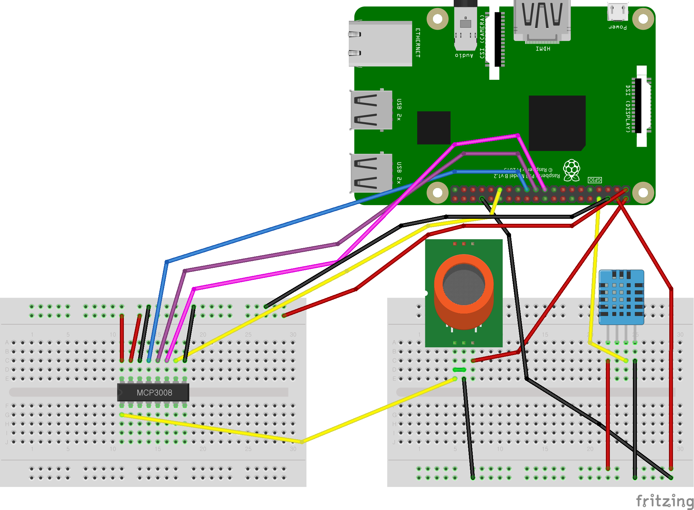

# Home-Sensor-EH-RaspberryPi

TU-Korea Engineering House Raspberry Pi course project

# Home-Sensor

## Development Environment
- 
- 
- 
- 
- 
- 

## Mobile Application Libraries
- [React Navigation](https://reactnavigation.org)
- [react-native-picker](https://github.com/react-native-picker/picker)
- [react-native-geolocation](https://www.npmjs.com/package/react-native-geolocation-service)
- [react-native-chart-kit](https://github.com/indiespirit/react-native-chart-kit)

## Public API
- [기상청 단기예보 ((구)동네예보) 조회서비스](https://www.data.go.kr/tcs/dss/selectApiDataDetailView.do?publicDataPk=15084084)

## Sensors
- MQ-135
- DHT-11

## Raspberry Pi Library
- Adafruit

## Raspberry Pi Code
- Original Code: https://github.com/KRIPT4/MQ135-ADS1115-Python

## What it looks like

### Home Screen
 

### Chart Screen
 

### Raspberry Pi

## What will be added

- <strike>Conversion from 
to  </strike> Done at 2022.07.08
- Refactoring
