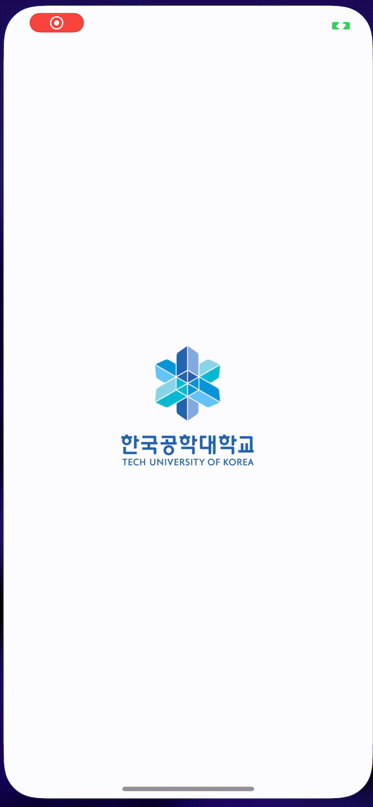
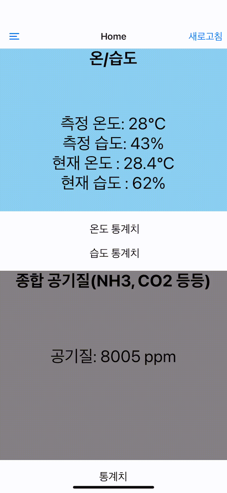

# Home-Sensor-EH-RaspberryPi

TU-Korea Engineering House Raspberry Pi course project

# Home-Sensor

## Development Environment
- 
- 
- 
- 
- 
- 

## Sensors
- MQ-135
- DHT-11

## Raspberry Pi Library
- Adafruit

## Raspberry Pi Code
- Original Code: https://github.com/KRIPT4/MQ135-ADS1115-Python

## What it looks like

### Home Screen
 

### Chart Screen
 

### Raspberry Pi

## What will be added

- Conversion from 
to  
- Refactoring
